# Distributed Architectures Workshop

**Course:** Software Architectures (ARSW) — Escuela Colombiana de Ingeniería Julio Garavito  
**Author:** Juan Pablo Vélez Muñoz

---

## Introduction

This workshop explores the evolution of distributed communication mechanisms in Java through six progressive exercises. Each exercise builds on the same domain — room and wellness management — but implements it using a different architectural style: TCP Sockets, HTTP, RMI, gRPC, Microservices, and API Gateway.

The goal is not just to write code, but to understand *why* each style exists and what problem it solves compared to the previous one.

---

## Concepts Covered

### Exercise 1 — TCP Sockets (Client-Server Architecture)

TCP Sockets allow a client program to send a request to a server listening on a specific port. The communication protocol is designed manually using plain text messages.

The key insight is that the developer must define every detail: message format, validation, error handling, and responses. This gives full control but requires more effort.

```
Client → "CONSULTAR_SALON,E303" → Server → "SALON_DISPONIBLE"
```

**Trade-off:** Full control over communication vs. manual protocol design and low-level handling.

---

### Exercise 2 — HTTP (Basic HTTP Architecture)

HTTP builds on top of TCP but adds a standard structure: method, route, parameters, headers, and body. This means any HTTP client (browser, Postman, curl) can consume the service — not just a Java client.

```
GET  /rooms
GET  /rooms?id=E303
POST /rooms/reserve?id=E303
POST /rooms/release?id=E303
```

**Trade-off:** Interoperability and accessibility from any client vs. having to design routes and response formats manually.

---

### Exercise 3 — Java RMI (Remote Procedure Call)

RMI (Remote Method Invocation) allows a Java object in one JVM to invoke methods of an object in another JVM. Instead of designing a text protocol, communication is expressed as method calls — much closer to regular programming.

The contract is defined as a Java interface extending `Remote`, and objects must implement `Serializable` to be transmitted over the network.

```java
public interface LabService extends Remote {
    List<String> consultarEquipos() throws RemoteException;
    String consultarEquipo(String codigo) throws RemoteException;
    boolean reservarEquipo(String codigo) throws RemoteException;
    boolean liberarEquipo(String codigo) throws RemoteException;
}
```

**Trade-off:** Natural method-call style vs. tight coupling to the Java ecosystem.

---

### Exercise 4 — gRPC (Modern RPC with Protocol Buffers)

gRPC is a modern RPC framework that defines contracts using `.proto` files. Unlike RMI, it is language-agnostic — a Java server can be consumed by clients in Python, Go, or any other supported language. Messages are strongly typed and serialized with Protocol Buffers, making them compact and fast.

Maven generates all Java classes from the `.proto` file automatically.

```protobuf
service AppointmentService {
  rpc RequestAppointment (AppointmentRequest) returns (AppointmentResponse);
  rpc CancelAppointment (CancelRequest) returns (CancelResponse);
  rpc GetAppointments (StudentRequest) returns (AppointmentList);
}
```

**Trade-off:** Formal contracts, efficiency, and interoperability vs. protobuf configuration overhead.

---

### Exercise 5 — Microservices

Instead of concentrating all responsibility in one service, microservices split the system into small, autonomous, and cohesive services. Each service owns its data and exposes its own gRPC contract.

```
Client
  ├── AppointmentService (port 50051)  → manages appointments
  └── GymService         (port 50052)  → manages gym sessions
```

**Trade-off:** Separation of concerns and scalability vs. increased operational complexity.

---

### Exercise 6 — API Gateway

When the client knows all microservices, it becomes tightly coupled to their addresses, ports, and individual contracts. An API Gateway centralizes access and acts as the single entry point.

```
Client → WellnessGateway → AppointmentService (50051)
                         → GymService         (50052)
```

The client only talks to the Gateway and never knows which internal service handles its request.

**Trade-off:** Single entry point and simplified client vs. potential bottleneck if the Gateway fails or grows too complex.

---

## Solutions

### Exercise 1 — TCP Room Management

**Files:** `exercise1-tcp-rooms/src/main/java/edu/eci/arsw/rooms/`

- `Room.java` — room model with id, capacity, and availability
- `RoomRepository.java` — in-memory store with book/release operations
- `RoomServerResponses.java` — enum for server responses
- `RoomServer.java` — TCP server listening on port 35000
- `RoomClient.java` — TCP client that sends commands and prints responses

---

### Exercise 2 — HTTP Room Management

**Files:** `exercise2-http-rooms/src/main/java/edu/eci/arsw/rooms/`

- Reuses `Room.java`, `RoomRepository.java`, and `RoomServerResponses.java`
- `RoomHttpServer.java` — HTTP server with three handlers: `RoomHandler`, `ReserveHandler`, `ReleaseHandler`

---

### Exercise 3 — RMI Lab Inventory

**Files:** `exercise3-rmi-labs/src/main/java/edu/eci/arsw/labs/`

- `Equipment.java` — serializable equipment model
- `LabService.java` — remote interface
- `LabServiceImpl.java` — service implementation extending `UnicastRemoteObject`
- `LabRmiServer.java` — publishes the service on port 23000
- `LabRmiClient.java` — looks up and calls all four methods

---

### Exercise 4 — gRPC Wellness Appointments

**Files:** `exercise4-grpc-wellness/src/main/`

- `proto/appointment.proto` — defines `AppointmentService`, enums `ServiceType` and `Status`, and all messages
- `java/.../AppointmentServiceImp.java` — implements the three RPC methods
- `java/.../WellnessServer.java` — gRPC server on port 50051
- `java/.../WellnessClient.java` — tests all three operations

---

### Exercise 5 — Microservices Wellness

**Files:** `exercise5-microservices-wellness/src/main/`

- `proto/appointment.proto` — appointment service contract
- `proto/gym.proto` — gym session service contract
- `java/.../AppointmentServiceImp.java` — appointment logic
- `java/.../GymServiceImp.java` — gym session logic
- `java/.../AppointmentServer.java` — server on port 50051
- `java/.../GymServer.java` — server on port 50052
- `java/.../WellnessClient.java` — client that consumes both services directly

---

### Exercise 6 — Wellness API Gateway

**Files:** `exercise6-wellness-gateway/src/main/`

- Reuses `appointment.proto` and `gym.proto`
- `java/.../WellnessGateway.java` — connects to both microservices internally and exposes three unified methods:
    - `requestAppointment(studentId, serviceType, date)`
    - `reserveGymSession(studentId, timeSlot)`
    - `getStudentWellnessSummary(studentId)`

---

## How to Run

### Prerequisites

- Java 21+
- Maven 3.9+

### Exercise 1 — TCP Sockets

```powershell
cd exercise1-tcp-rooms
mvn compile

# Terminal 1 - Server
mvn exec:java "-Dexec.mainClass=edu.eci.arsw.rooms.RoomServer"

# Terminal 2 - Client
mvn exec:java "-Dexec.mainClass=edu.eci.arsw.rooms.RoomClient"
# Input example: CONSULTAR_SALON,E303
```

### Exercise 2 — HTTP

```powershell
cd exercise2-http-rooms
mvn compile

# Terminal 1 - Server
mvn exec:java "-Dexec.mainClass=edu.eci.arsw.rooms.RoomHttpServer"

# Test with Postman or curl:
# GET  http://localhost:8080/rooms
# GET  http://localhost:8080/rooms?id=E303
# POST http://localhost:8080/rooms/reserve?id=E303
# POST http://localhost:8080/rooms/release?id=E303
```

### Exercise 3 — RMI

```powershell
cd exercise3-rmi-labs
mvn compile

# Terminal 1 - Server
mvn exec:java "-Dexec.mainClass=edu.eci.arsw.labs.LabRmiServer"

# Terminal 2 - Client
mvn exec:java "-Dexec.mainClass=edu.eci.arsw.labs.LabRmiClient"
```

### Exercise 4 — gRPC

```powershell
cd exercise4-grpc-wellness
mvn compile

# Terminal 1 - Server
mvn exec:java "-Dexec.mainClass=edu.eci.arsw.wellness.WellnessServer"

# Terminal 2 - Client
mvn exec:java "-Dexec.mainClass=edu.eci.arsw.wellness.WellnessClient"
```

### Exercise 5 — Microservices

```powershell
cd exercise5-microservices-wellness
mvn compile

# Terminal 1 - Appointment Server
mvn exec:java "-Dexec.mainClass=edu.eci.arsw.wellness.AppointmentServer"

# Terminal 2 - Gym Server
mvn exec:java "-Dexec.mainClass=edu.eci.arsw.wellness.GymServer"

# Terminal 3 - Client
mvn exec:java "-Dexec.mainClass=edu.eci.arsw.wellness.WellnessClient"
```

### Exercise 6 — API Gateway

```powershell
cd exercise6-wellness-gateway
mvn compile

# Terminal 1 - Appointment Server (from exercise5 or exercise6)
mvn exec:java "-Dexec.mainClass=edu.eci.arsw.wellness.AppointmentServer"

# Terminal 2 - Gym Server
mvn exec:java "-Dexec.mainClass=edu.eci.arsw.wellness.GymServer"

# Terminal 3 - Gateway
mvn exec:java "-Dexec.mainClass=edu.eci.arsw.wellness.WellnessGateway"
```

---

## Results

### Exercise 1 — TCP Sockets

Server started and client connected. The protocol correctly handled room lookup, booking, and release. State persisted across client calls.

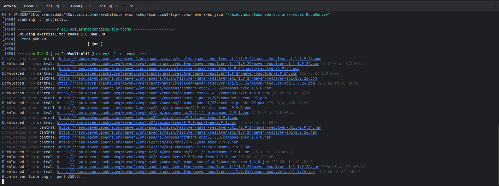
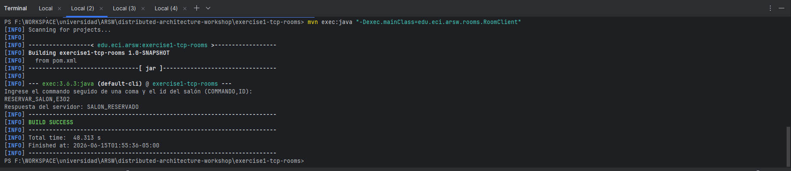
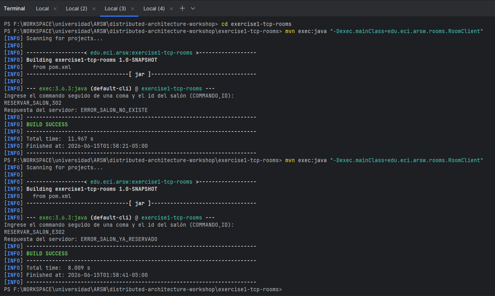
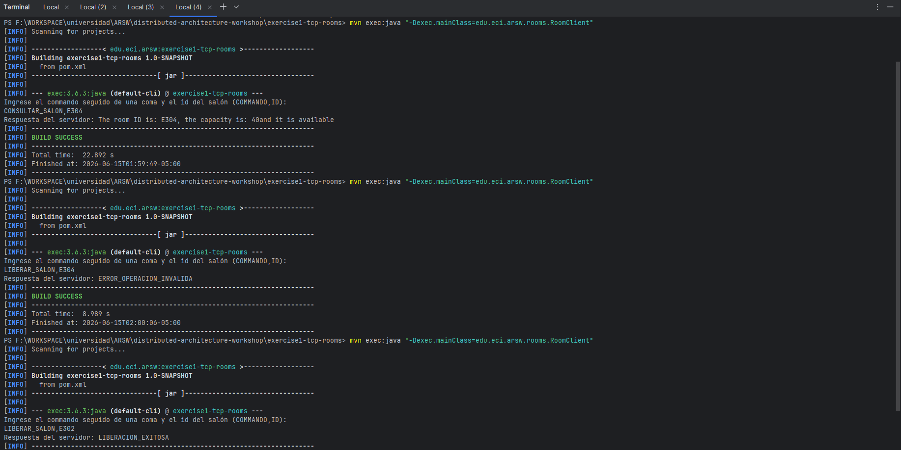

---

### Exercise 2 — HTTP

HTTP server exposed all four endpoints. Tested with Postman — all operations returned correct HTML responses with status 200.

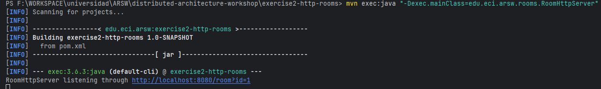
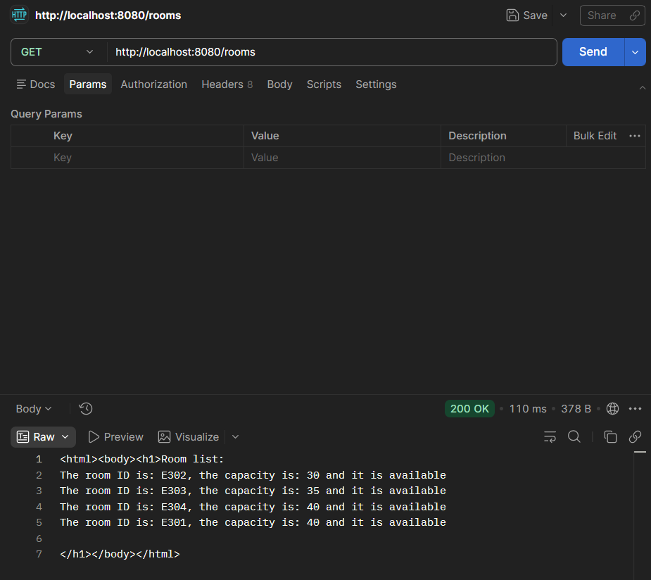
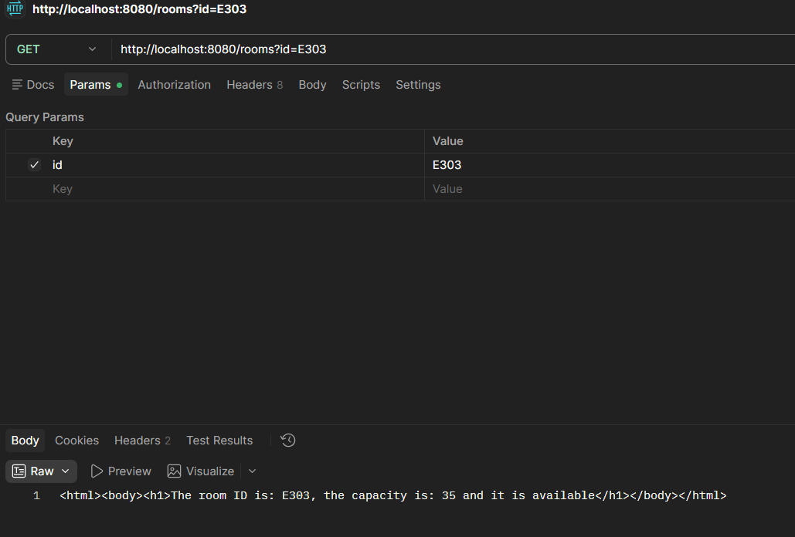
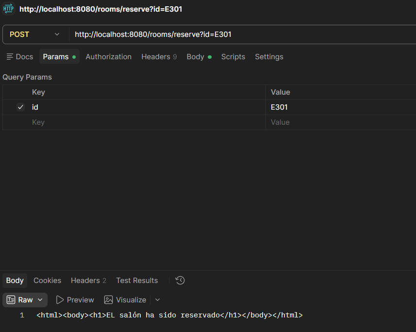
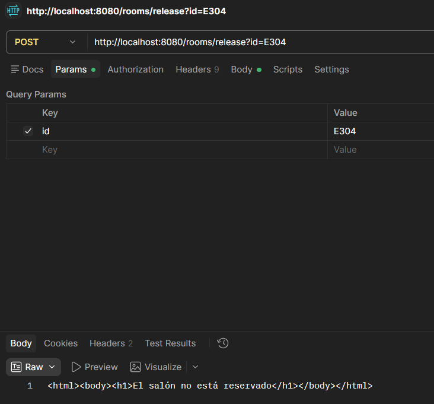
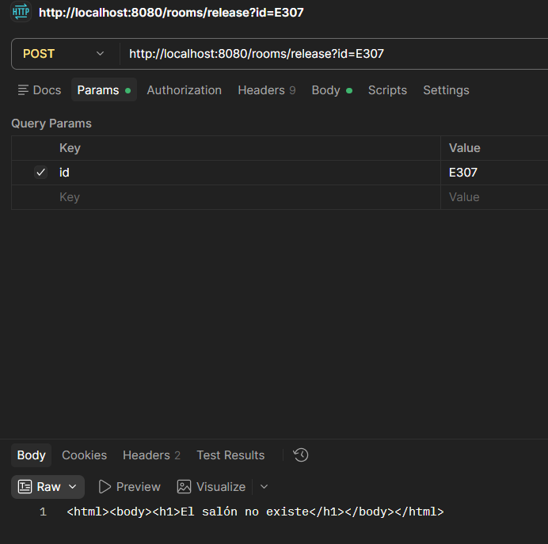
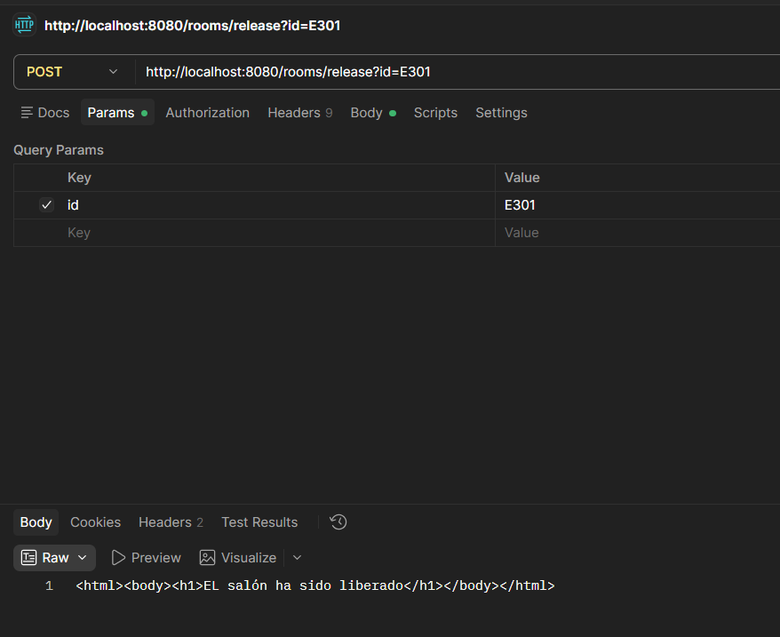

---

### Exercise 3 — RMI

RMI server published on port 23000. Client successfully invoked all four remote methods and received correct responses.

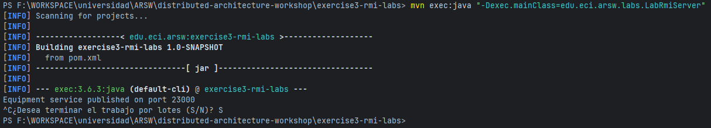
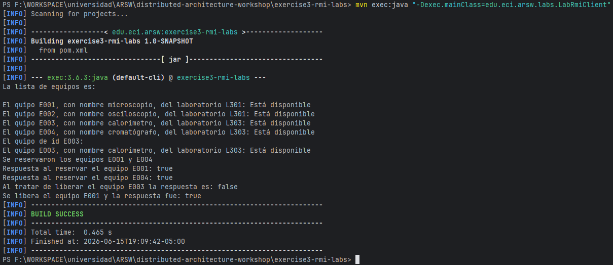

---

### Exercise 4 — gRPC

gRPC server started on port 50051. Client tested appointment creation, cancellation, and listing — all working correctly through the generated stubs.

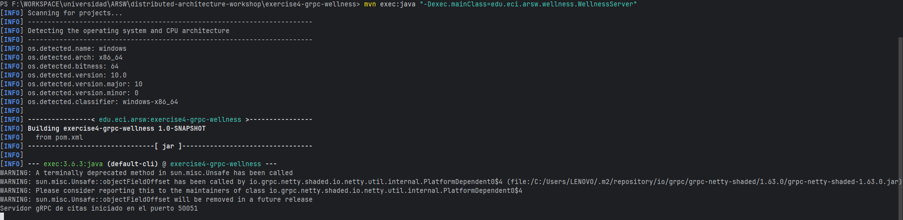
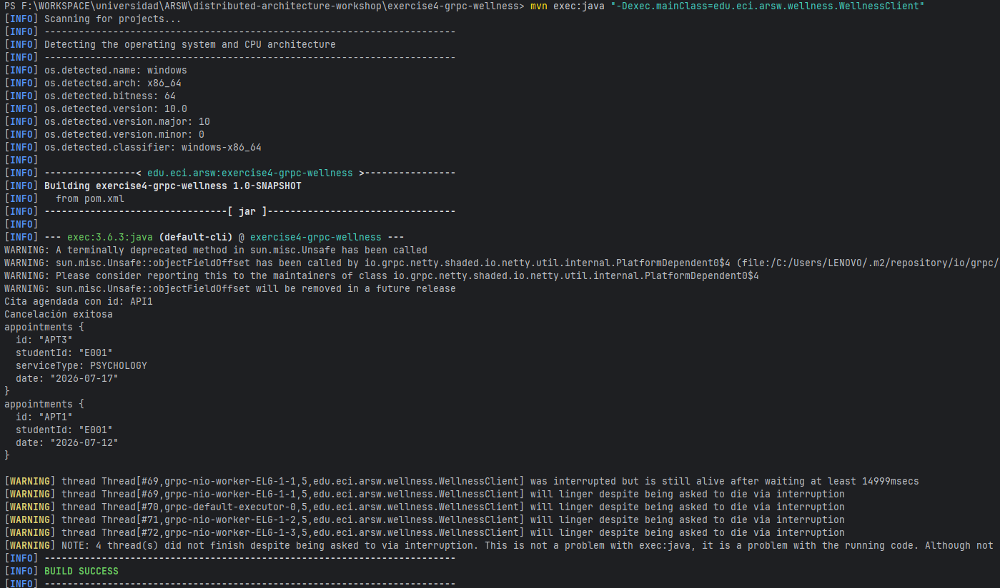

---

### Exercise 5 — Microservices

Two independent gRPC servers ran simultaneously on different ports. The client connected to each one directly and consumed both services.

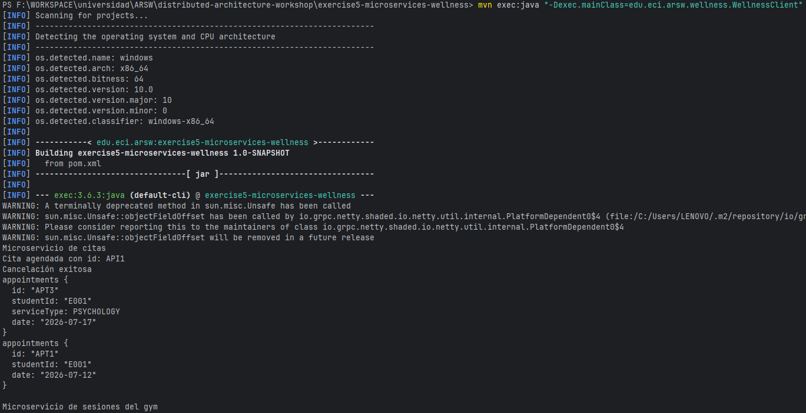
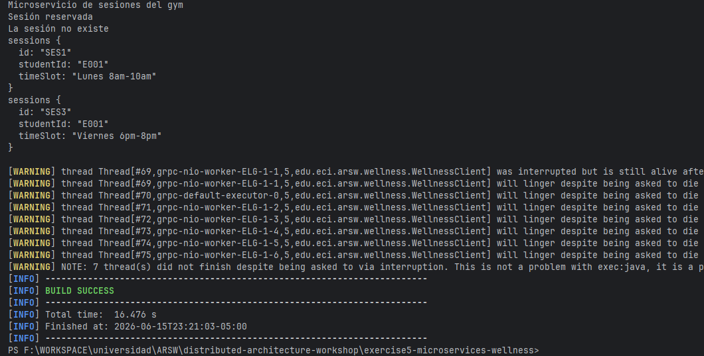
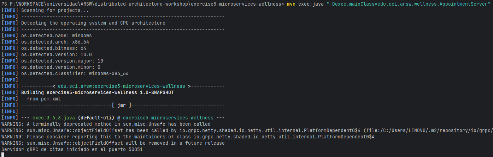
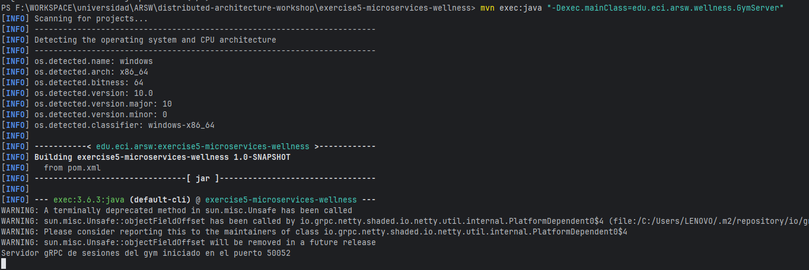

---

### Exercise 6 — API Gateway

The Gateway unified access to both microservices. The client only interacted with the Gateway and received consolidated responses without knowing the internal ports.

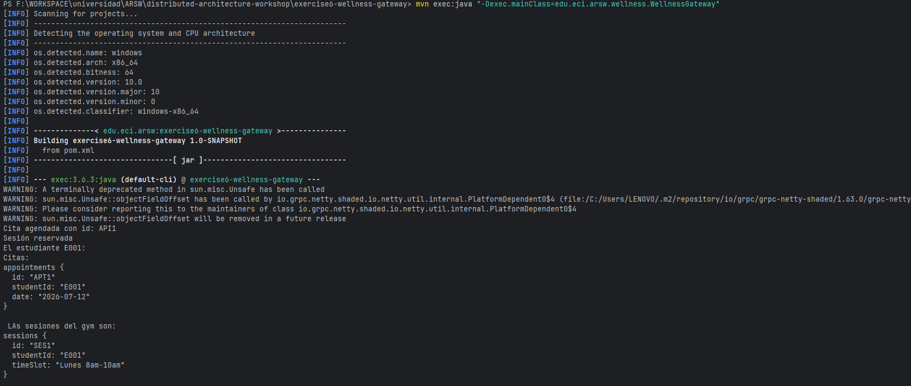
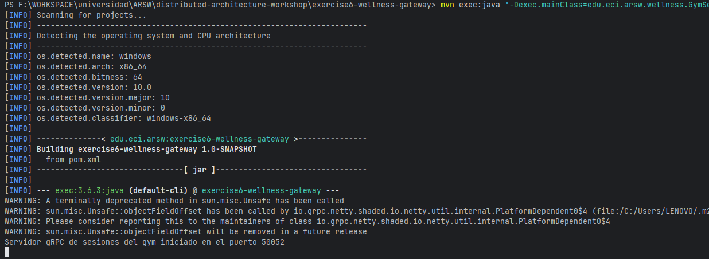
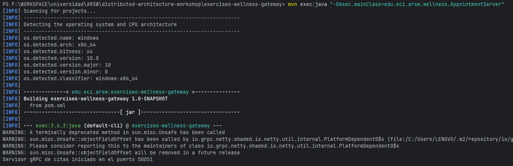